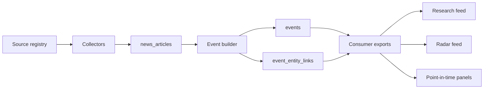

# News Event Hub

Event-first news ingestion and research signal infrastructure.

`News Event Hub` turns fragmented news feeds, official releases, API-backed sources, and early social signals into structured events that downstream research systems can reuse. It is not a news reader, a newsletter generator, or a raw-news warehouse. Its job is to convert noisy articles into a shared event layer:

```text
collect -> normalize -> fuse evidence -> map entities -> rank by view -> export
```

The project was originally built for investment research workflows, but the core pattern is more general: any system that needs reusable event intelligence from mixed-quality news sources can use the same pipeline.

## Why It Exists

Most news systems stop at one of three layers:

- collect many feeds and return article lists
- wrap one or more news APIs behind a common interface
- summarize headlines into a daily digest

That is useful, but it leaves the hardest work to every downstream consumer: deduplication, evidence quality, entity mapping, event lifecycle, and ranking. `News Event Hub` moves those concerns into a shared layer so dashboards, research agents, alerting systems, and quant pipelines can start from the same event interpretation.

## What Makes It Different

- **Event-first model**: articles are raw evidence; the primary output is a structured `event` with supporting articles, state, score vectors, and entity links.
- **Confirmation lane and signal lane**: official filings, exchange announcements, macro releases, and wires are modeled separately from forums, social sources, and tracked searches. Social attention is not treated as factual confirmation.
- **Independent evidence counting**: evidence is counted by source family, not just article volume, so duplicated syndication does not automatically look like stronger confirmation.
- **Event state machine**: events move through states such as `watch`, `emerging`, `confirmed`, `contested`, and `mature`, making lifecycle explicit for consumers.
- **Research-oriented mapping**: events are mapped to companies, industries, institutions, macro themes, and long-running topics so a research workflow can start from an object, not a keyword search.
- **View-specific ranking**: global feeds, research retrieval, radar views, and point-in-time panels have different ranking goals. The hub exports contracts and score components rather than forcing every consumer to share one headline popularity score.
- **Discovery writes back**: on-demand company or topic discovery can fetch missing context and write it back into the same article and event pipeline instead of leaving useful findings in one-off scripts.
- **Backtest-friendly exports**: point-in-time panels and event window snapshots are designed for replay, audit, and later quantitative event studies.
- **Private runtime boundary**: API keys, cookies, browser storage state, SQLite databases, logs, and large generated outputs are intentionally kept out of Git and guarded by a secret hygiene check.

## Core Model



- **Article**: normalized source output with title, URL, timestamp quality, source id, and collector metadata.
- **Event**: the smallest shared consumption unit. It represents a meaningful change, not just a headline.
- **Topic**: a longer-running theme or object that can contain multiple related events.
- **Update**: new evidence or a new sub-fact attached to an existing event.
- **Entity link**: mapping from events to companies, industries, institutions, macro themes, and topics.
- **Consumer export**: JSON views for research, radar, opportunity feeds, and point-in-time panels.

## Source Lanes

`News Event Hub` separates sources by role:

- **Confirmation lane**: regulatory filings, exchange announcements, official macro releases, public agencies, newswires, and high-trust news APIs.
- **Signal lane**: social platforms, forums, tracked searches, and browser-backed sources that may surface early interest or rumors.
- **On-demand recall**: optional search/API connectors used when a research target has insufficient coverage.

Optional API-backed sources are env-gated. Examples include `MARKETAUX_API_KEY`, `MEDIASTACK_API_KEY`, and `SERPSTACK_API_KEY`. These keys belong in the local runtime environment, never in the repository.

## Quick Start

Create a local environment:

```bash
python3 -m venv .venv
source .venv/bin/activate
python -m pip install -r requirements.txt
```

Optional connectors may need additional packages:

```bash
pip install akshare playwright
python -m playwright install chromium
```

Validate the source registry and initialize a local SQLite database:

```bash
python3 scripts/init_unified_news_db.py --check-only
python3 scripts/init_unified_news_db.py --db runtime/news_event.db
```

Run the core smoke tests:

```bash
python3 scripts/smoke_test_event_layer.py
python3 scripts/smoke_test_consumer_views.py
python3 scripts/smoke_test_live_collector.py
python3 scripts/smoke_test_fred_us_macro_import.py
```

Run a small local pipeline:

```bash
python3 scripts/run_live_news_collector.py --db runtime/news_event.db --force --limit-sources 3
python3 scripts/build_event_layer.py --db runtime/news_event.db --lookback-days 7
python3 scripts/export_consumer_views.py --db runtime/news_event.db --output-root state/consumer_exports
```

## Security Boundary

This repository is intentionally source-only. Commit these:

- Python scripts
- schema and source registry config
- systemd templates and deployment wrappers
- small durable mappings
- docs and smoke tests

Do not commit these:

- API keys or `.env` files
- SSH keys, SSH config, known hosts, private hostnames, private IP addresses, private ports, or jump-host details
- cookies or browser `storage_state` JSON
- SQLite databases
- runtime caches
- logs
- large generated exports
- downloaded upstream data payloads

Keep repository-level GitHub secret scanning and push protection enabled.
Maintainer-specific release scans should live outside this public repository.

## Repository Layout

| Path | Purpose |
| --- | --- |
| `config/` | Source registry, schema, collector catalogs, export policy, service templates |
| `data/` | Small durable mappings, such as entity aliases |
| `docs/` | Architecture, source inventory, event/ranking contracts, runtime notes |
| `scripts/` | Collectors, importers, event builder, exports, smoke tests, deployment helpers |
| `runtime/` | Local runtime databases and caches. Ignored by Git |
| `state/` | Local auth state and generated consumer exports. Ignored by Git |
| `logs/` | Runtime logs. Ignored by Git |

## Main Entrypoints

| Command | Role |
| --- | --- |
| `scripts/init_unified_news_db.py` | Initialize schema and seed the source registry |
| `scripts/run_live_news_collector.py` | Collect due live sources into `news_articles` |
| `scripts/import_fred_us_macro_open_data.py` | Import structured FRED U.S. macro release events |
| `scripts/build_event_layer.py` | Build and rank events from article windows |
| `scripts/replay_event_layer_windows.py` | Generate resumable day, week, month, and year event snapshots |
| `scripts/export_consumer_views.py` | Export research, radar, opportunity, and point-in-time JSON views |

## Outputs

The consumer export layer currently writes JSON views such as:

- `research_feed_latest.json`
- `industry_radar_feed_latest.json`
- `opportunity_report_feed_latest.json`
- `entity_day_panel_latest.json`
- `industry_day_panel_latest.json`
- `institution_day_panel_latest.json`
- `source_health_latest.json`
- `mapping_review_latest.json`

Generated outputs belong under `state/` or another ignored runtime directory, not in Git.

## Documentation

- [License](LICENSE)
- [Security policy](SECURITY.md)
- [Contributing guide](CONTRIBUTING.md)
- [Public release checklist](docs/public_release_checklist.md)
- [Product definition](docs/product_definition.md)
- [Architecture](docs/architecture.md)
- [Unified source inventory](docs/unified_news_source_inventory.md)
- [Event V1 definition](docs/event_v1_definition.md)
- [Layer 2 ranking contract](docs/layer2_ranking_contract_v1.md)
- [Article to event merge rules](docs/article_to_event_merge_rules_v1.md)
- [Mapping layer contract](docs/mapping_layer_v1.md)
- [Layer 3 consumer contract](docs/layer3_consumer_contract_v1.md)
- [Current status](STATUS.md)

## Current Status

This repository is public-ready source infrastructure. The core SQLite-based pipeline, source registry, event builder, consumer exports, smoke tests, and secret hygiene guard are in place. Some connectors require local credentials, browser state, or optional dependencies and are disabled unless explicitly configured.

Before release-facing changes, review:

- secret hygiene results
- private runtime and SSH/infrastructure references in current files and reachable history
- source licensing and platform terms
- optional API connector documentation
- runtime deployment instructions
- any remaining internal path or environment assumptions in docs

## Not Investment Advice

`News Event Hub` is infrastructure for event ingestion and research workflow support. It does not make investment decisions, predict returns, or provide investment advice.
